# Resolução - Atividade 03 - Transações e Controle de Concorrência
## Questão 1 (4,5)

Considere o seguinte cenário com itens de dados: A, B, C, todos com valor inicial 100. Duas transações (T1 e T2) executam operações sobre esses itens conforme indicado abaixo.

| T1 | T2 |
| :--- | :--- |
| R1(A); | R2(B); |
| R1(B); | R2(C); |
| S1 = A + B; | S2 = B + C; |
| W1(C, S1); -- escreve em C o valor da soma | W2(A, S2); -- escreve em A o valor da soma |

### Com base nessas informações, responda as questões a seguir.

Q1a. (2,0) Apresente um escalonamento possível em que T1 e T2 são executadas <b>concorrentemente</b>, mas cujo resultado <b>NÃO é seriável</b>. Demonstre que seu escalonamento não é seriável.


Q1b. (2,5) Apresente um escalonamento possível em que T1 e T2 são executadas concorrentemente, mas cujo resultado É seriável.
## Resposta da Questão 1
### Escalonamentos Seriais

### Plano S1 T1 -> T2

| Tempo | T1 | T2 | Efeito |
| :--- | :--- | :--- | :--- |
| 1 | R1(A) | | T1 lê A=100 |
| 2 | R1(B) | | T1 lê B=100 |
| 3 | S1 = A + B | | S1 = 100 + 100 = 200 |
| 4 | W1(C, S1) | | C é atualizado para 200 |
| 5 | | R2(B) | T2 lê B=100 |
| 6 | | R2(C) | T2 lê C=200 |
| 7 | | S2 = B + C | S2 = 100 + 200 = 300 |
| 8 | | W2(A, S2) | A é atualizado para 300 |

### Plano S2 T2 -> T1

| Tempo | T1 | T2 | Efeito |
| :--- | :--- | :--- | :--- |
| 1 | | R2(B) | T2 lê B=100 |
| 2 | | R2(C) | T2 lê C=100 |
| 3 | | S2 = B + C | S2 = 100 + 100 = 200 |
| 4 | | W2(A, S2) | A é atualizado para 200 |
| 5 | R1(A) | | T1 lê A=200 |
| 6 | R1(B) | | T1 lê B=100 |
| 7 | S1 = A + B | | S1 = 200 + 100 = 300 |
| 8 | W1(C, S1) | | C é atualizado para 300 |

| Plano | A | B | C |
|:--- | :--- | :--- | :--- |
| Inicial | 100 | 100 | 100 |
| Plano S1 (T1 -> T2) | 300 | 100 | 200 |
| Plano S2 (T2 -> T1) | 200 | 100 | 300 |
### O que eu quero: 
- Concorrência - No contexto se traduz: Intercalação das operações de transações distintas
- Não seriável (Q1a) - Resultado final deve ser distindo de um escalonamento serial.
- Seriável (Q1b) - Resultado final deve ser igual a um dos resultados do escalonamento serial.


### Plano K - Há concorrência, mas não é seriável devido ao resultado final
| Tempo | T1 | T2 | Efeito |
| :--- | :--- | :--- | :--- |
| 1 | R1(A) | | T1 lê A=100 |
| 2 | R1(B) | | T1 lê B=100 |
| 3 | | R2(B) | T2 lê B=100 |
| 4 | | R2(C) | T2 lê C=200 |
| 5 | S1 = A + B | | S1 = 100 + 100 = 200 |
| 6 | W1(C, S1) | | C é atualizado para 200, mas a operação foi perdida |
| 7 | | S2 = B + C | S2 = 100 + 100 = 200 |
| 8 | | W2(A, S2) | A é atualizado para 200 |

### Plano Ks - Há concorrência e é seriável. 
| Tempo | T1 | T2 | Efeito |
| :--- | :--- | :--- | :--- |
| 1 | R1(A) | | T1 lê A=100 |
| 2 | R1(B) | | T1 lê B=100 |
| 3 | | R2(B) | T2 lê B=100 |
| 4 | S1 = A + B | | S1 = 100 + 100 = 200 |
| 5 | W1(C, S1) | | C é atualizado para 200, mas a operação foi perdida |
| 6 | | R2(C) | T2 lê C=200 |
| 7 | | S2 = B + C | S2 = 100 + 100 = 200 |
| 8 | | W2(A, S2) | A é atualizado para 200 |

| Plano | A | B | C |
|:--- | :--- | :--- | :--- |
| Inicial | 100 | 100 | 100 |
| Plano S1 (T1 -> T2) | 300 | 100 | 200 |
| Plano S2 (T2 -> T1) | 200 | 100 | 300 |
| Plano K (Não Seriável)| 200 | 100 | 200 |

### Valor final das variáveis para cada aplicação de plano.

- Para considerar um plano não seriável o resultado final precisa ser distinto dos possíveis planos seriáveis, ou seja, nesse caso S1 e S1.

| Plano | A | B | C |
|:--- | :--- | :--- | :--- |
| Inicial | 100 | 100 | 100 |
| Plano S1 (T1 -> T2) | 300 | 100 | 200 |
| Plano S2 (T2 -> T1) | 200 | 100 | 300 |
| Plano Ks (Seriável) | 200 | 100 | 300 |

### Anotações e observações

#### OBS:

- Houve concorrência nos exemplos acima, e garantimos consistência com o fato das transações serem seriáveis. Mas o que a concorrência trouxe de positivo? Nessa caso nada, mas 

#### Concorrência vs Paralelismo:


#### Escalonamento: Conceito

Conjunto de operações de transações, no qual as opereações de uma mesma transação se mantém em ordem relativa, mas as oporações de transações distintas podem ser intercaladas a fim de alcançar a concorrência.

Resultado Não Seriável e Seriável: 
Seja A, e B duas transações com {a1,a,2,...,an} e {b1,b2,...,bn} operações dessas respectivamente, e x,y,z variáveis usadas nessas transações.

Um plano X é dito seriável se e somente x, o valor de x,y,z após a aplicação das operações x1,x2...xn resultar em valores de x,y,z iguais a um dos resultados dos Planos: seq(A,B),seq(B,A).

> *Não Serial* é diferente de *Não Seriável*.
> 
> *Serial* é diferente de *Seriável*.


## Questão 2 (5,5)

Nessa questão, você irá explorar como o PostgreSQL gerencia a concorrência em diferentes níveis de isolamento de transações, e como o MVCC lida com conflitos entre transações concorrentes.

### 1. Preparação do Ambiente

Primeiro, execute o seguinte script SQL para criar e popular a tabela `contas`:

```sql
CREATE TABLE contas (
  id INT PRIMARY KEY, 
  saldo NUMERIC
);

INSERT INTO contas VALUES (1, 100), (2, 100);
```

### 2. Transações para Teste

As transações a serem executadas concorrentemente são:

**Transação A**
```sql
-- Inicia a transação A
BEGIN;
-- Define o nível de isolamento (ex: SET TRANSACTION ISOLATION LEVEL READ COMMITTED;)
SELECT saldo FROM contas WHERE id = 1;
UPDATE contas SET saldo = saldo - 50 WHERE id = 1;
-- Pausa para permitir que a outra transação atue
SELECT pg_sleep(15);
COMMIT;
```

**Transação B**
```sql
-- Inicia a transação B
BEGIN;
-- Define o nível de isolamento (ex: SET TRANSACTION ISOLATION LEVEL READ COMMITTED;)
SELECT saldo FROM contas WHERE id = 2;
UPDATE contas SET saldo = saldo - 50 WHERE id = 2;
-- Faz a soma enquanto a Transação A ainda não terminou
INSERT INTO contas VALUES (3, (SELECT SUM(saldo) FROM contas));
COMMIT;
```

### 3. Cenário de Execução

Execute as duas transações três vezes, cada vez alterando o nível de isolamento da sessão para: `READ COMMITTED`, `REPEATABLE READ` e `SERIALIZABLE`.

O fluxo de execução deve ser o seguinte:
1. Inicie a **Transação A** e execute-a até o comando `pg_sleep(15)`. A transação ficará em pausa por 15 segundos.
2. Durante essa pausa, execute **toda** a **Transação B**.
3. Após a pausa, volte à sessão da **Transação A** e finalize-a com `COMMIT`.

### 4. Questões

Para cada um dos três níveis de isolamento testados, responda:

**Q2a. (1,0)** Apresente o registro de sua execução, destacando os valores do saldo.

**Q2b. (1,5)** Qual foi o nível de isolamento que apresentou erro? Explique o porquê desse erro.

**Q2c. (3,0)** Indique uma das formas possíveis de contornar o erro que você identificou no item 2.b, modifique a transação (ou transações) e demonstre que funciona.

## Resposta da Questão 2

```sql
-- Reseta a tabela para o estado inicial
TRUNCATE TABLE contas; 

INSERT INTO contas (id, saldo) VALUES
(1, 100), (2, 100);
```
> [!WARNING]
> **Nota para o Professor:** Para conseguir diferenciar os resultados entre os níveis de isolamento, o fluxo de execução original foi modificado. O novo fluxo, que gerou os resultados apresentados, foi o seguinte:
>
> 1.  **Iniciar Transação A:** Executar os comandos até a pausa (`pg_sleep`).
> 2.  **Iniciar Transação B:** Executar os comandos até o `UPDATE` na `conta id = 2`.
> 3.  **Commit da Transação A:** Finalizar e salvar as alterações da Transação A enquanto a Transação B ainda está em andamento.
> 4.  **Continuar Transação B:** Voltar para a Transação B e executar o comando `INSERT` que calcula a soma dos saldos.
> 5.  **Commit da Transação B:** Finalizar e salvar as alterações da Transação B.


### Nota de estudo.

02.11.2025 
- Durante os testes usei o SupaBase como ferramenta para executar as transações, e notei que o autocommit é habilitado para o client web, então não conseguia iniciar uma transação e controlar o commit de finalização das transações devido o autocommit que muda a conexão (usa um pool). 
Então a princípio fiz da seguinte maneira: Executei uma após a outra e fiz uma query para verificar as conexões ativas enquanto a transação A ainda "dormia". Assim, NESSAS condições o resultado foi identico para o `READ COMMITTED`, `REPEATABLE READ`, e deixei os prints apenas da execuções do `SERIALIZABLE` para não poluir muito o relatório e deixei os valores em timeline das outras.

#### OBS pós término do relatório

04.11.2025

- Não houve diferença mesmo roando o bloco de uma vez, só tive mais trabalho configurando o DBeaver para realizar as transações passo a passo, mas aprendi bastante coisa diferente.

#### OBS revisando o trabalho e encontrando um problema no fluxo

06.11.2025
- Acho que entendi o problema... após rodar com o DBeaver notei que o fluxo do enunciado não leva ao teste dos isolamentos, pois o commit da transação A deveria acontecer antes do insert da transação B, então refiz os testes com esse fluxo corrigido e tive resultados distintos para os níveis de isolamento READ COMMITTED e REPEATABLE READ e finalmente entendi a diferença entre eles, isso graças a um artigo no Medium: https://medium.com/@darora8/transaction-isolation-in-postgres-ec4d34a65462


# Começando com o `SERIALIZABLE`, único que apresentou erro.
- 02.11.2025 

TA -> TB -> TC -> STSeeping -> AutoCommit ->STAwake

#### Transação A
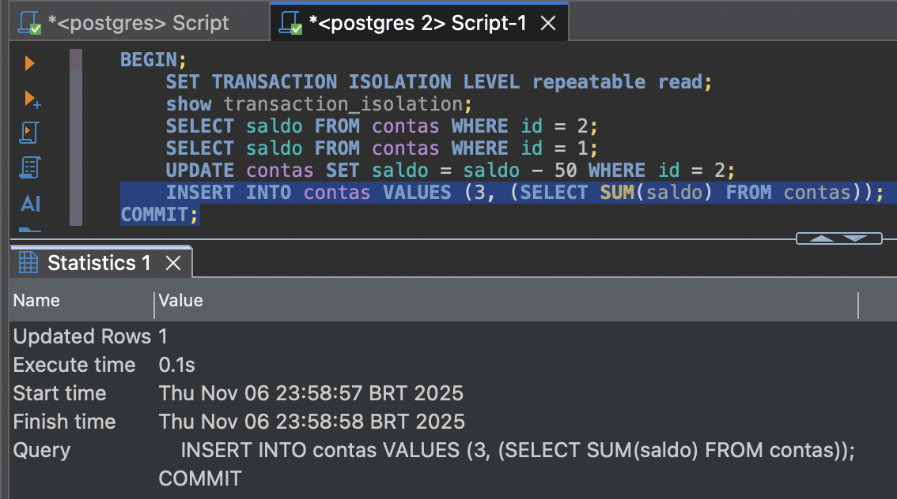
#### Transação B
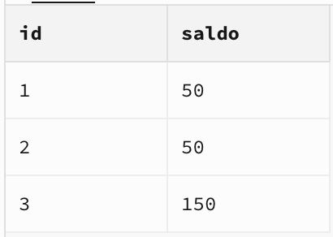

#### Select das Conexões existentes
- Aqui aparecem duas, a do próprio select e outra da transação A por ainda estar no sleep. Nesse momento eu já executei a transação B, por isso não aparece no select.

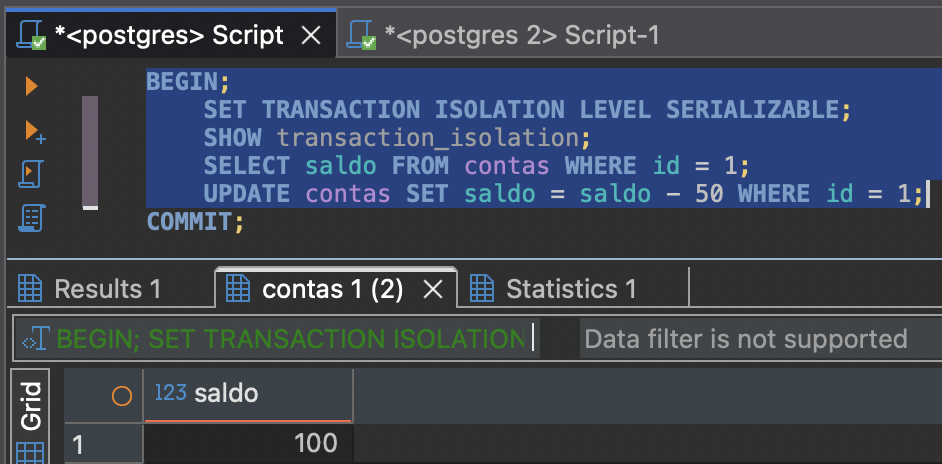

#### Tabela de Contas enquanto a transação A ainda não terminou
- Quando a transação A terminou ela se manteve a mesma - já que deu erro - por isso deixei apenas 1 print.


#### AutoCommit
- Quando o sleep acabou e o autocommit executou e esse foi o erro:

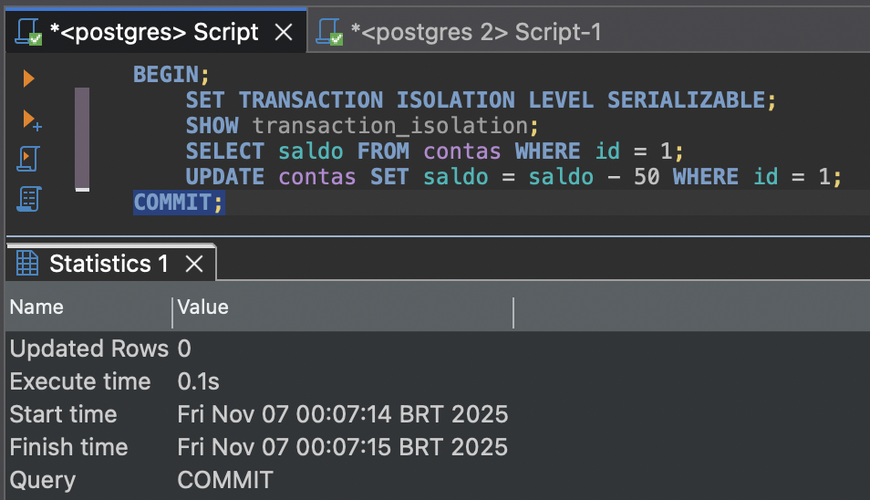

# `READ COMMITTED`, `REPEATABLE READ`, evidências por desencargo de consciência.

#### Transação A
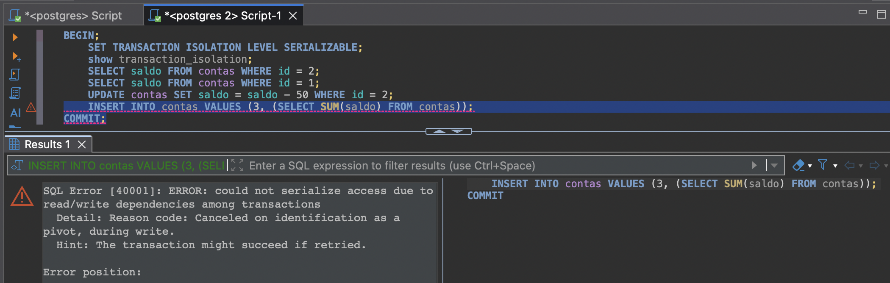

#### Transação B
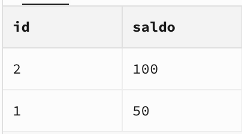


- Usando `REPEATABLE READ`, quando rodei essa transação tbm rodei a TA com `REPEATABLE READ`

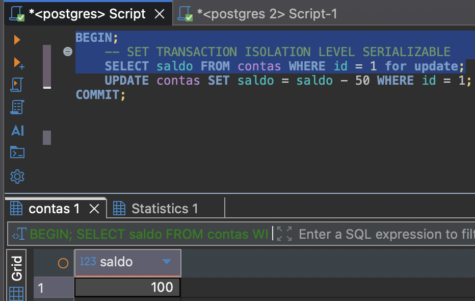

#### Tabela contas após transação B e durante Sleeping da A
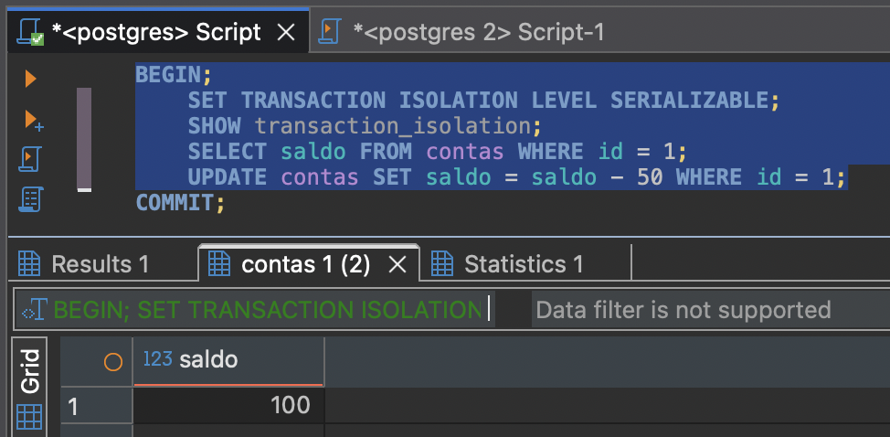
#### Conexões Durante sleeping
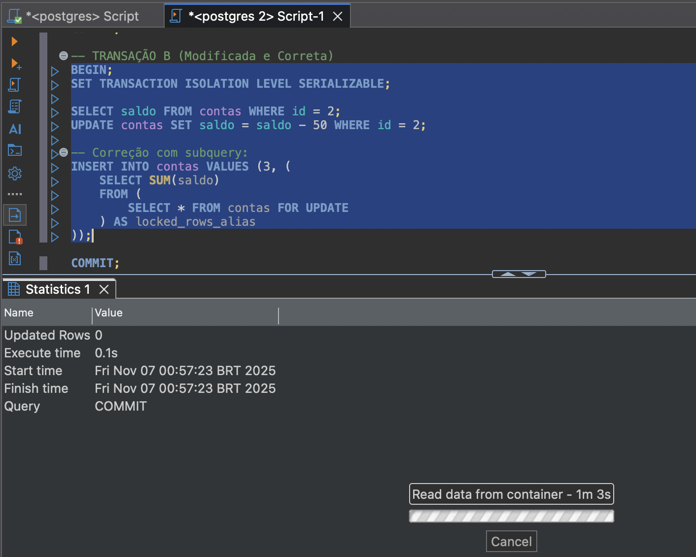
#### Tabela contas após a transação A acordar.
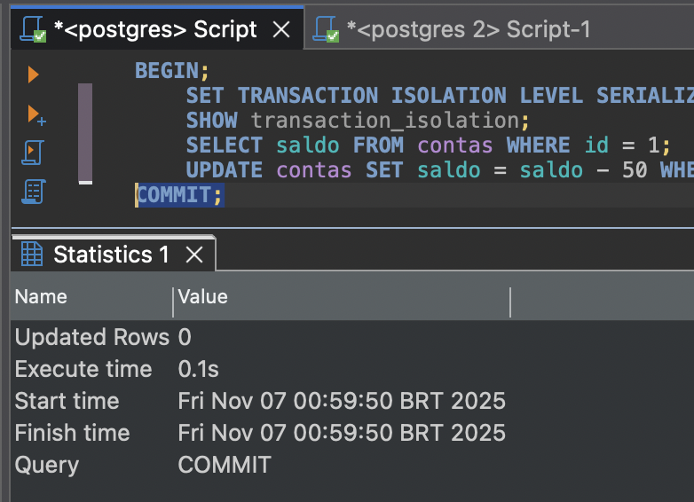


### Linha do Tempo do Estado da Tabela `contas` para `READ COMMITTED` e `REPEATABLE READ`


**1. Estado Inicial**

```
| id | saldo |
|----|-------|
| 1  | 100   |
| 2  | 100   |
```

**2. Durante a Transação A (Após o `UPDATE`, antes do `COMMIT`)**
*Visão da própria Transação A:*

Como a Transação A enxerga os dados logo após seu `UPDATE`, mas antes de `COMMIT`. 

```
| id | saldo |
|----|-------|
| 1  | 50    |
| 2  | 100   |
```

**3. Durante a Transação B (Enquanto A está em pausa)**
*Visão da Transação B (não enxerga a mudança de A):*

Ela não vê a alteração da Transação A (que ainda não foi commitada), mas vê a sua própria.

```
| id | saldo |
|----|-------|
| 1  | 100   |
| 2  | 50    |
```

**4. Após o `COMMIT` da Transação B**
*Visão global (novas transações enxergam a linha 3):*

O estado da tabela contas após a transação B ser commitada. 
```
| id | saldo |
|----|-------|
| 1  | 100   |
| 2  | 50    |
| 3  | 150   |
```

**5. Estado Final (Após o `COMMIT` da Transação A)**
*Visão global final:*

O estado final da tabela após a Transação A finalmente dar `COMMIT`. 
```
| id | saldo |
|----|-------|
| 1  | 50    |
| 2  | 50    |
| 3  | 150   |
```

# Usando o DBeaver para conectar no SupaBase.

Com o DBeaver eu consigo iniciar uma transação e commita-la manualmente. Veremos se tem alguma diferença.

# Usando `READ COMMITTED`:

## TA até o sleeping

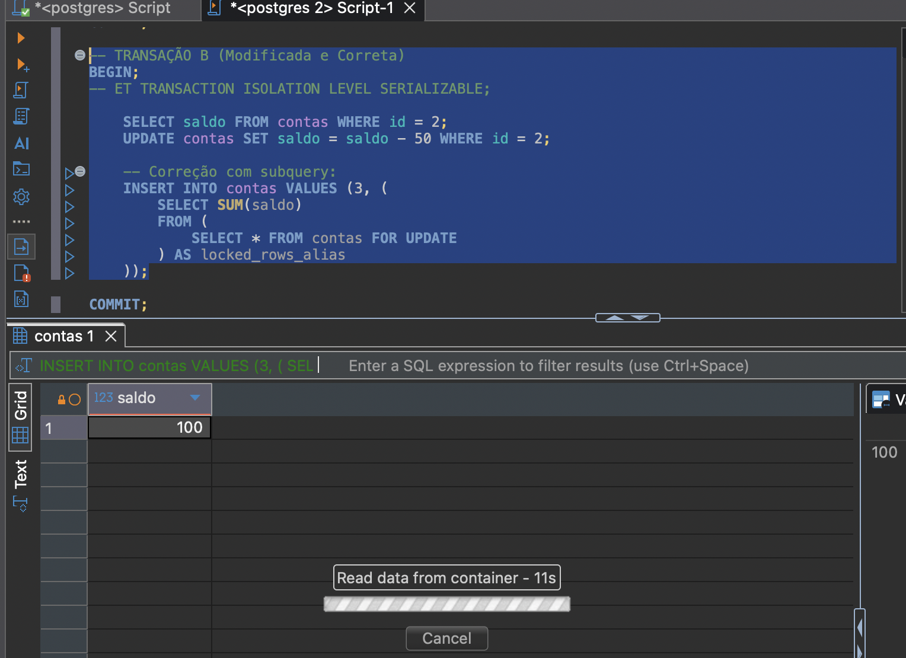

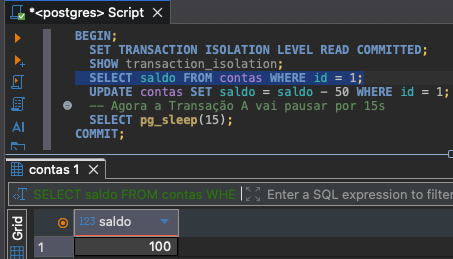

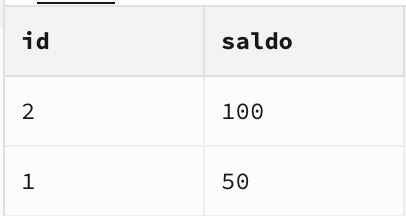

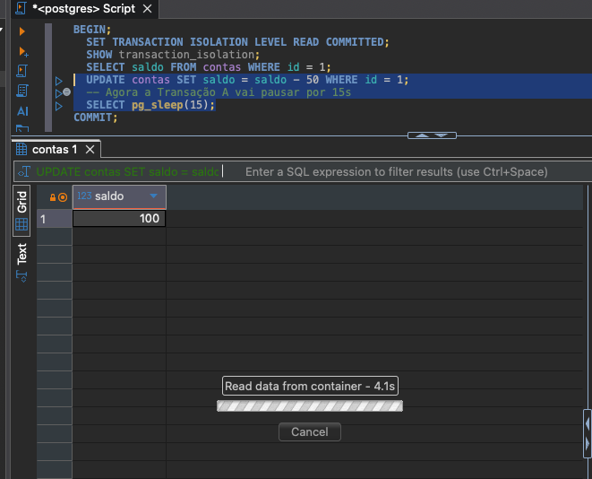

## TB com saldo id = 2
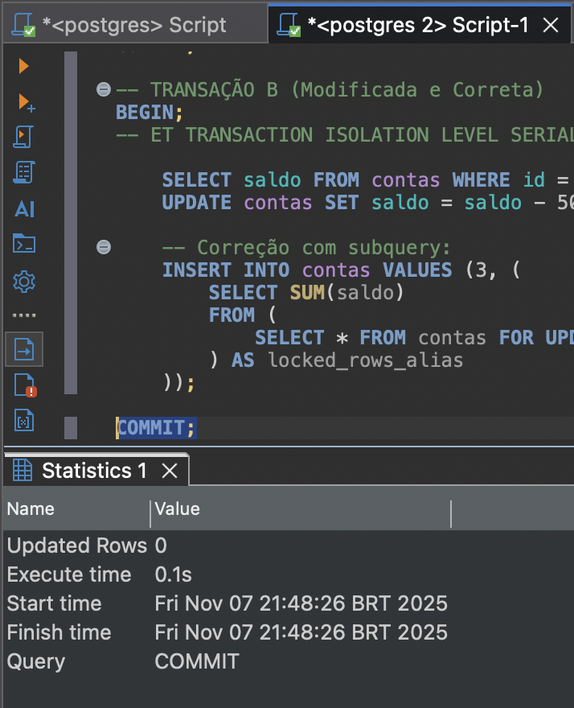

## Tabela contas: 
- ainda com TA sleeping, e após TB. Ou seja, o resuldado - id = 3 - dirá qual o valor que TB viu do saldo de ID = 1, se a soma for 150 então significa que TB viu o dado desatualizado, se o valor da soma for 100 TB viu o saldo após o update de TA.

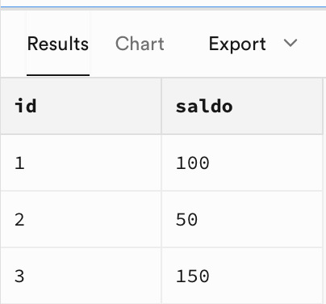

Então TB viu o valor antes do commit.

## Commit de TB


## Sem transação em andamento, evidência
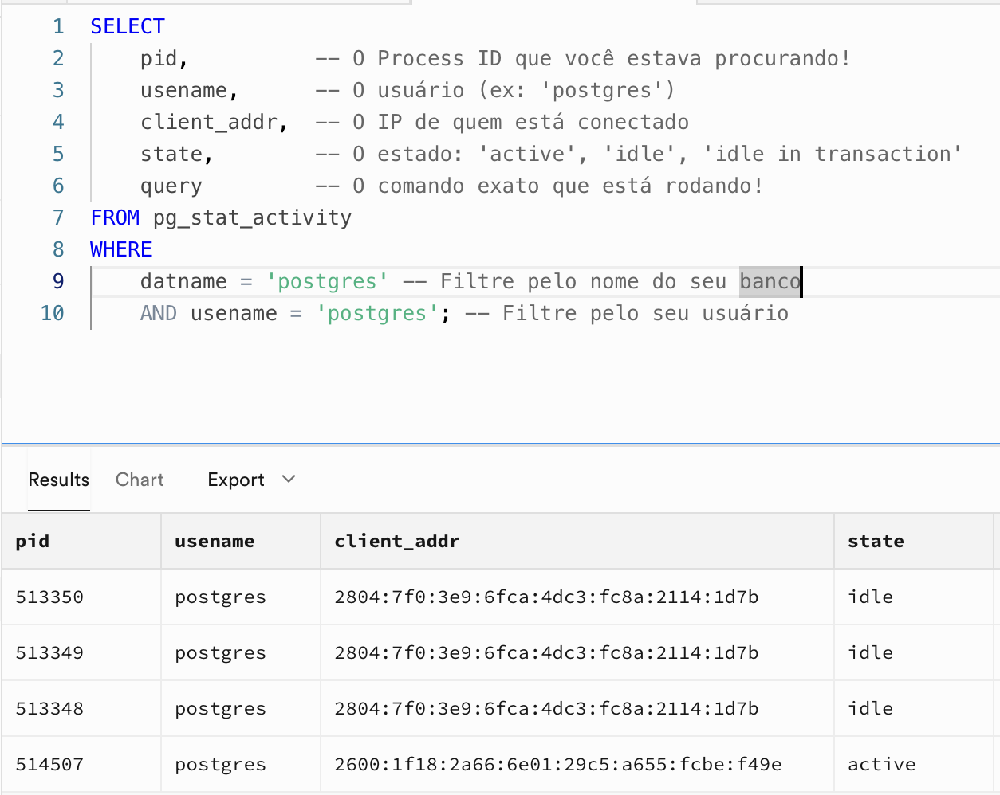


## Tabela Contas após o commit:


# Usando `READ COMMITTED`:


## TA

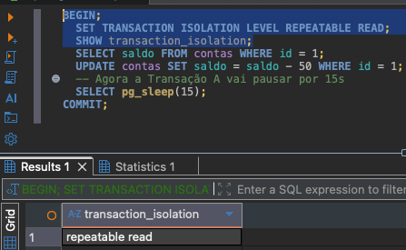

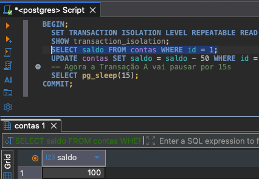

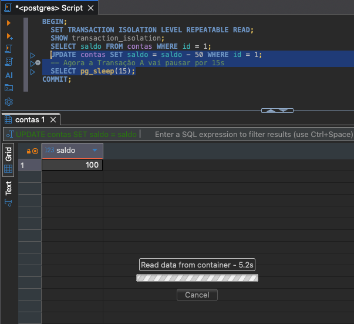

## TB

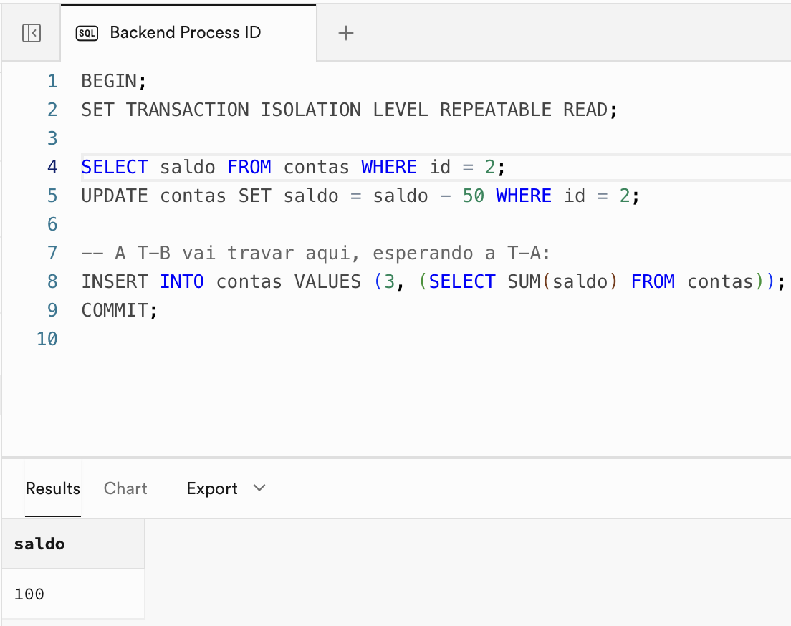

## Contas durante o sleeping


## Commtit TA


## Contas após commit TA


# Usando `SERIALIZABLE`

TA


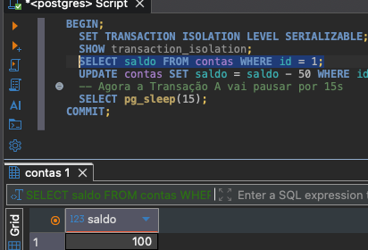


TB

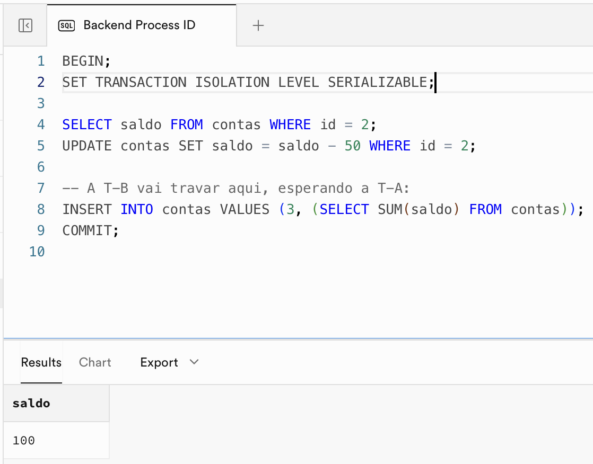

## Contas com TA dormindo e TB commitada


## Erro no commit da ta


**Q2b. (1,5)** Qual foi o nível de isolamento que apresentou erro? Explique o porquê desse erro.

Foi o serializable, no commit da TA. O erro aconteceu porque o isolamento serializable simula um funcionamento em fila, e como os dados da transação A nesse caso já estão desatualizados com a versão atual o commit não será permitido no momento da comparação das versões.

**Q2c. (3,0)** Indique uma das formas possíveis de contornar o erro que você identificou no item 2.b, modifique a transação (ou transações) e demonstre que funciona.

Lendo um artigo sobre o tema (https://medium.com/@darora8/transaction-isolation-in-postgres-ec4d34a65462) encontrei que o postgress não tem suporte ao level de isolamento uncommited read que permitiria a leitura dos dados em o versionamento para cada transação, que resultaria no valor de ID 3 "correto", mas perderiamos a consistencia de dados para commits que tivessem rollback e assim permitindo a a leitura de dados fantasmas como cita o artigo.

Uma forma simples de contornar a situação é refazer a transação.


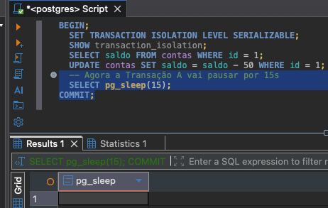

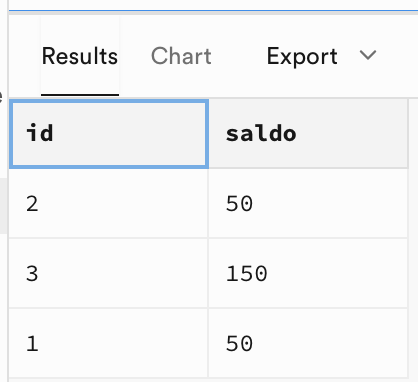

