# Resolução - Atividade 04 - Manipulação e Transação em Grafos

# Atividade desenvolvida por: 
- Kayque Moraes - 11202130076
- Paulinho - 

## Conceitos/Definições:

WAL - Write-Ahead Log é uma técnica utilizada em sistemas de gerenciamento de banco de dados para garantir a durabilidade e a consistência das transações. O WAL registra todas as operações de modificação de dados antes que essas operações sejam aplicadas ao banco de dados. Isso permite que, em caso de falha do sistema, as transações possam ser recuperadas a partir do log, garantindo que nenhuma operação seja perdida.
Artigo interessante sobre WAL:
    - https://medium.com/@vinciabhinav7/write-ahead-logs-but-why-494c3efd722d
    
Neo4j tem suporte a transações ACID (Atomicidade, Consistência, Isolamento e Durabilidade). Isso significa que as operações realizadas dentro de uma transação são tratadas como uma única unidade de trabalho, garantindo que todas as operações sejam concluídas com sucesso ou nenhuma delas seja aplicada. O Neo4j utiliza o WAL para garantir a durabilidade das transações, registrando todas as alterações no log antes de aplicá-las ao banco de dados.

```WARNING: 
São Single Thread transactions, ou seja, cada transação é executada em uma única thread, o que simplifica o gerenciamento de concorrência e evita problemas relacionados a bloqueios e deadlocks. Isso significa que, quando uma transação está em andamento, outras transações devem aguardar sua conclusão antes de serem iniciadas.
```

Isolamento padrão é o nível de isolamento "Read Committed", que garante que uma transação só possa ler dados que foram confirmados por outras transações. Isso evita a leitura de dados não confirmados (dirty reads) e garante que as transações vejam um estado consistente do banco de dados.

Bolt é um protocolo de comunicação binário desenvolvido especificamente para o Neo4j. Ele é projetado para ser eficiente e rápido, permitindo que os clientes se conectem ao banco de dados Neo4j e executem consultas e operações de forma eficaz. O Bolt é otimizado para trabalhar com grafos, facilitando a transferência de dados entre o cliente e o servidor.
Link de referencia: 

# Questão 1 (3.5):
Considere uma instância para o grafo `ALUNO` -[`FAZ`]→`CURSO`.

**TA:**
atualize (crie) um atributo qualquer na aresta `[FAZ]` partindo da seleção do aluno
não dê o commit

**TB:**
atualize (crie) outro atributo qualquer na aresta `[FAZ]` partindo da seleção do curso
não dê o commit

**TC:**
atualize (crie) um atributo qualquer no nó `ALUNO` partindo da seleção do mesmo.
não dê o commit

**TD:**
leia o atributo que você acrescentou na transação TA.

---

Com base nessas transações, responda as questões a seguir.

**Q1a. (1,75)** Crie três sessões simultâneas para executar as transações na seguinte ordem: TA→TB→TC. Quando você efetuar o *commit* dentro da transação TA, TC irá executar? Porque? Demonstre.

**Q1b. (1,75)** Crie três sessões simultâneas para executar as transações na seguinte ordem: TA→TD. A leitura do atributo foi possível ou não pela TD? Por que? Demonstre.

## Conexões:

Criei 3 usuários diferentes no Neo4j com as mesmas permissões apenas para facilitar a identificação das conexões:


neo4j command:
```
CREATE USER kayque1 SET PASSWORD 'xpto1234' CHANGE NOT REQUIRED;
GRANT ROLE admin TO kayque1;
```     

## Conectei os 3 usuários em 3 terminais diferentes e listei as conexões:
```
call dbms.listConnections();
```   


- 3 terminais conectados com 3 usuários diferentes


## Criando o grafo inicial:
```
CREATE (a:Aluno {nome: 'Kayque'})-[:FAZ {quadrimestre: '2025Q3'}]->(c:Curso {nome: 'IBD'});
```


## Montandos as transações:
### Transação TA:
```
:BEGIN

/* TA: Atualiza a ARESTA partindo do ALUNO */
MATCH (a:Aluno {nome: 'Kayque'})-[r:FAZ]->(c:Curso {nome: 'IBD'})
SET r.atributo_TA = 'valor_TA'
RETURN r;
```

### Transação TB:
```
:BEGIN

/* TB: Atualiza a ARESTA partindo do CURSO */
MATCH (c:Curso {nome: 'IBD'})<-[r:FAZ]-(a:Aluno {nome: 'Kayque'})
SET r.atributo_TB = 'valor_TB'
RETURN r;
```
### Transação TC:
```
:BEGIN

/* TC: Atualiza o NÓ ALUNO partindo do ALUNO */
MATCH (a:Aluno {nome: 'Kayque'})
SET a.atributo_TC = 'valor_TC'
RETURN a;
```

### Transação TD:
```
/* TD: Lê o atributo da Transação TA */
MATCH ()-[r:FAZ {semestre: 2025}]-()
RETURN r.atributo_TA;
```

### Prints das execuções:
- Status: Antes do COMMIT da TA
- o # no terminal indica que a transação está aberta (sem COMMIT ou ROLLBACK).


### Prints das transações TA, TB e TC com show transactions:
- A TB está travada (aguardando o COMMIT da TA)
- A TC executou normalmente (pois bloqueia o nó, não a aresta)


### Commit de TA:


- Após o COMMIT da TA, a TB executou normalmente (pois o lock foi liberado). 

## Explicação/Reposta Q1a:
 ```
 Quando TA inicia, ela adquire um bloqueio de escrita na aresta [FAZ]. Enquanto TA não for commitada, qualquer outra transação que tente modificar a mesma aresta, como TB, ficará bloqueada até que TA seja concluída - como visto na primeira imagem das transações. Isso garante a integridade dos dados e evita conflitos de escrita simultânea. Portanto, TB só pode prosseguir após o commit de TA, momento em que o bloqueio é liberado. O nível de lock é granular, o que isso quer dizer: que o bloqueio é aplicado apenas à aresta específica que está sendo modificada, permitindo que outras partes do grafo sejam acessadas ou modificadas por outras transações sem interferência, e mesmmo assim a TC conseguiu executar normalmente, pois bloqueia o nó, não a aresta.
 ```


## Explicação/Reposta Q1b:
## Testando com a alteração de um atributo já existente:
### Antes de executar o COMMIT da TA:


### Após executar o COMMIT da TA:


## Testando com a criação de um atributo novo:

### Antes do COMMIT da TA:


### Após o COMMIT da TA:


## Explicação/Reposta Q1b:
```
A transação TD não conseguiu ler o atributo criado por TA antes da execução do commit, e curiosamente não deu erro mesmo com o atributo sendo inexistente, algo que se espera por exemplo num banco de dados relacional... Enfim, a leitura só foi possível após o commit de TA, demonstrando o isolamento "Read Committed"
```

## Questão 2 (2,5):

Criando os nós e arestas iniciais:
```
// // Cria o grafo conforme a descrição
CREATE (a:Pessoa {nome: 'Ana'}),
       (b:Pessoa {nome: 'Bruno'}),
       (c:Pessoa {nome: 'Carla'}),
       (a)-[:AMIGO_DE]->(b),
       (b)-[:AMIGO_DE]->(c);
```
- obs: ainda tem o grafo da atividade 1, mas não interfere.
- obs2: vamos assumir que a query do enunciado tb está incorreta ao usar "Bruno Silva", e que o correto é "Bruno".

ficando:
```
begin;
match (b:Pessoa {nome: 'Bruno'}) delete b;
```
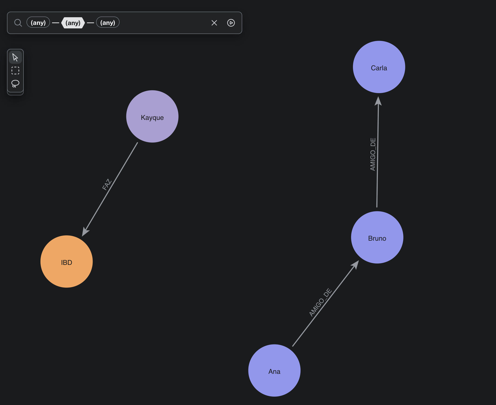

## Antes do commit, mas iniciado o delete em tb:

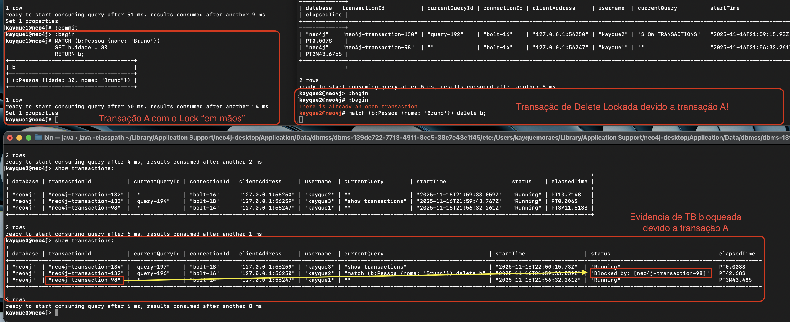

- Aqui podemos observar que a transação B fica bloqueada pela transação A, aguardando o commit ou rollback da TA para prosseguir, pois estão olhando para o mesmo ponteiro (nó Bruno). Algo semelhante ao que ocorreu na questão 1 até então.

## Após o commit da transação A:

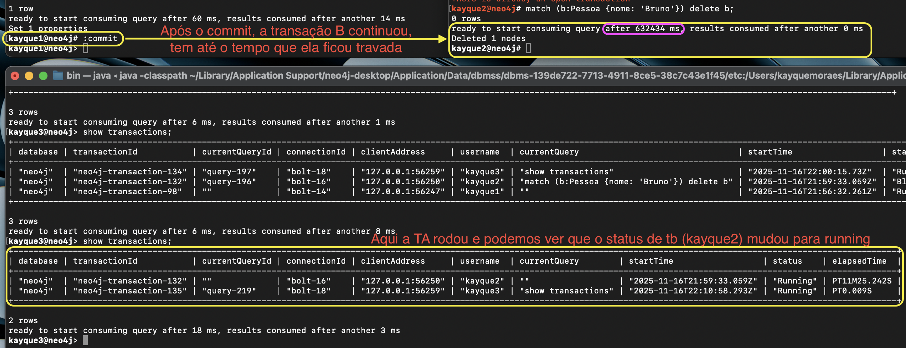

## Após o commit de tb:

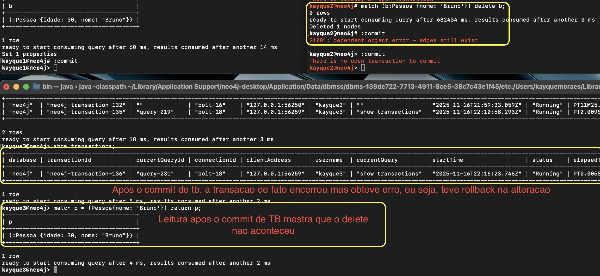

- aqui a transacao B falha, nao conseguiu deletar o nó Bruno devido ao erro G1001 - dependent object error - edges still exist. Segundo a documentação do neo4j esse erro acontce quando tentamos deletar um nó que ainda possui arestas conectadas a ele. O Neo4j não permite a remoção de nós que têm relacionamentos ativos, a menos que esses relacionamentos sejam removidos primeiro. 
Exemplo, vamos tentar deletar o nó Ana e Carla:

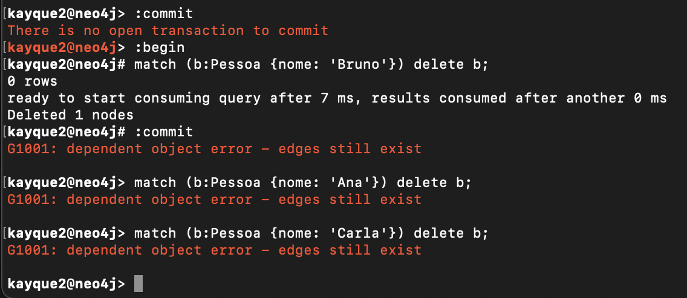

Para ambas as tentativas, o Neo4j retorna o mesmo erro G1001, indicando que não é possível deletar esses nós porque eles ainda possuem arestas conectadas a eles.

### Como deletar então?

Vamos fazer isso usando o `DETACH DELETE`, que remove o nó e todas as suas arestas conectadas em uma única operação.

Buscando a tradução direta segundo o Cambridge Dictionary:

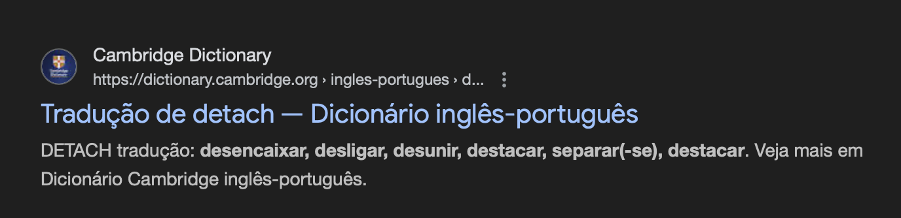

### Testando o plano de execução:

Vamos usar o `EXPLAIN` que nos mostra o plano de execução da query sem realmente executá-la para ver se os detalhes dessa operação mostram a remoção das arestas associadas ao nó Bruno.


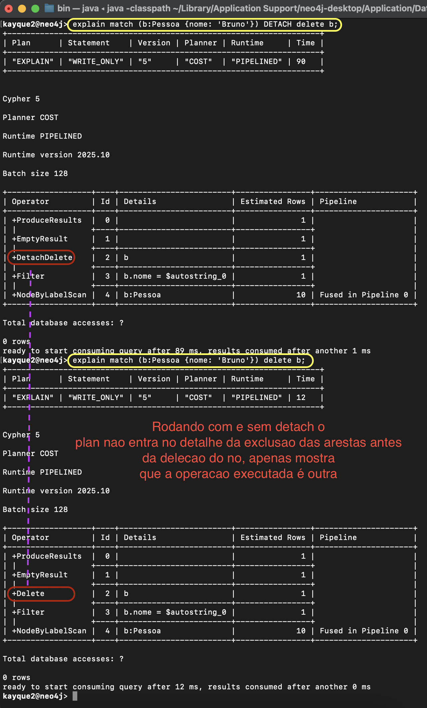

Aqui infelizmente não conseguimos ver o plano completo de remoção das arestas, mas valeu a tentativa.

Vamos executar a query agora e ver se funciona:

```
MATCH (b:Pessoa {nome: 'Bruno'}) DETACH DELETE b;
```

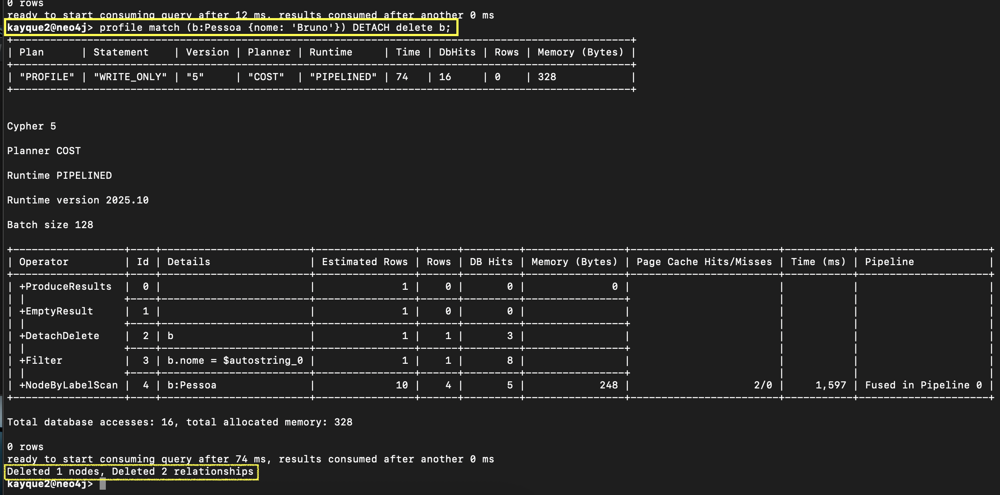
- Aqui vemos que a operação foi bem sucedida, o nó Bruno e duas arestas foram deletadas
### Validando a exclusão:
```
MATCH (n:Pessoa {nome: 'Bruno'}) RETURN n;
```
#### Usando o explorer

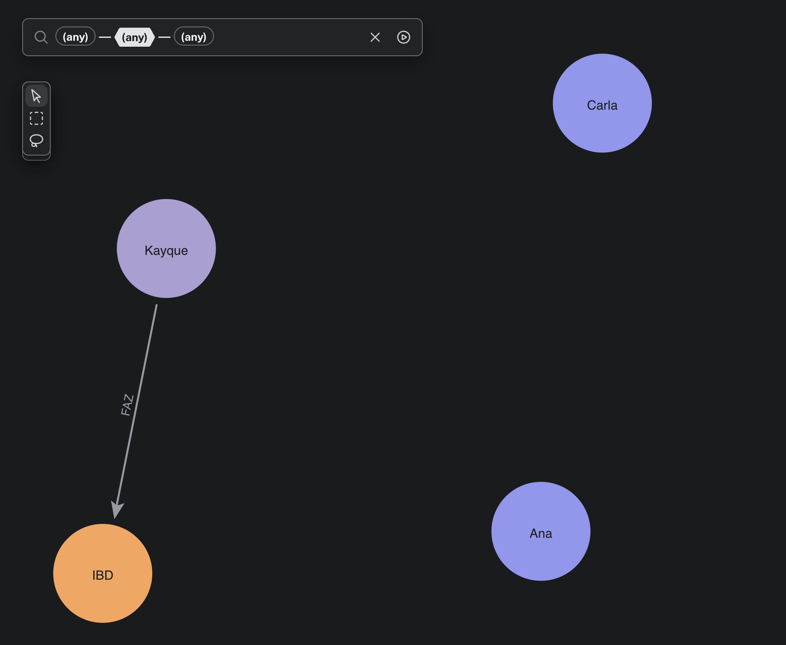

#### Usando o cypher shell

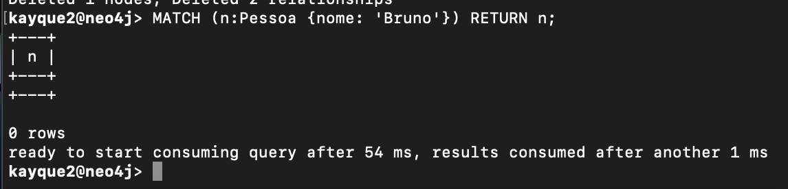

Assim respondemos a questão 2.

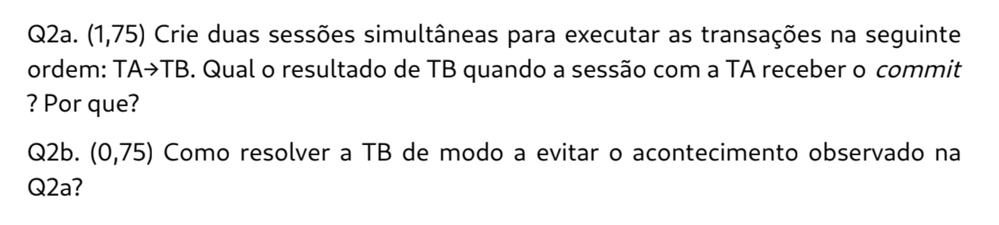

Explicitamente:

q2a: Não acontece a deleção porque o neo4j usa ponteiro associadosdos aos nós e arestas, e a transação B está aguardando o commit ou rollback da transação A para prosseguir, pois estão olhando para o mesmo ponteiro (nó Bruno).

q2b: Para resolver o problema, podemos usar o comando `DETACH DELETE`, que remove o nó e todas as suas arestas conectadas em uma única operação. Isso garante que não haja arestas pendentes que impeçam a exclusão do nó.


## Q3a. (1,5) Como você garantiria que todos os nós e arestas do grafo MOVIE estão completos (com todos os atributos)? Que estratégia de manipulação você usaria para identificar nós e arestas incoerentes?

- Para avaliar nós e relações tais quais suas propriedades estejam incompletas, deve ser feita uma filtragem utilizando WHERE buscando pelo valor null. Ademais, se quisermos adicionarmos um valor para esta propriedade, o faremos usando SET.

- O processo ideal seria termos a modelagem e avaliarmos cada propriedade para cada nó e aresta quanto à ausência de propriedade. O que foi feito para este cenário foi a verificação para cada tipo de nó e relação. 
- O caso em que foi encontrada propriedade incompleta foi para `born`, para o nó do tipo Person.

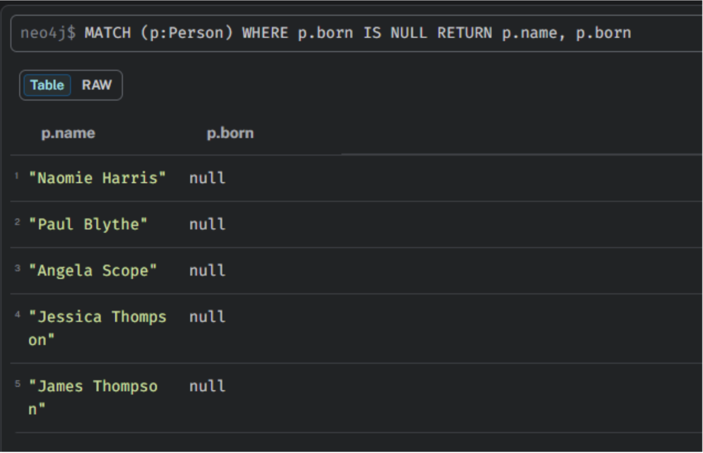

- Nesse sentido, podemos atualizar a propriedade unitariamente para cada pessoa, com seu respectivo valor.
Exemplo (não foi executado):
MATCH (p:Person {name: 'Paul Blythe'}) SET p.born = 1995 RETURN p.name, p.born


## Q3b. (1,5) Suponha que você tem filmes ou pessoas duplicadas no grafo MOVIE. Como você faria a limpeza de dados sem perder conexões no grafo? Quais propriedades ou relações você precisa preservar? Escolha um filme e pessoa a sua escolha e aplique sua operação de limpeza.

- Vamos criar nós duplicados. Temos o mesmo personagem e, para cada, temos duas arestas distintas. 

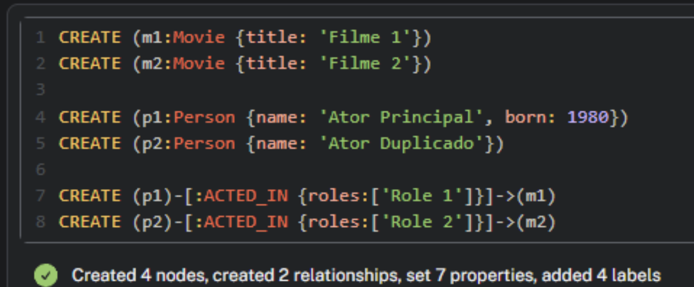

- O que fazemos é avaliar os dois nós de pessoas. Note que o ator principal possui a propriedade born adicionalmente a p2. O escolhemos como nó principal e, se houvessem outras propriedades no nó duplicado, deveríamos passá-las.

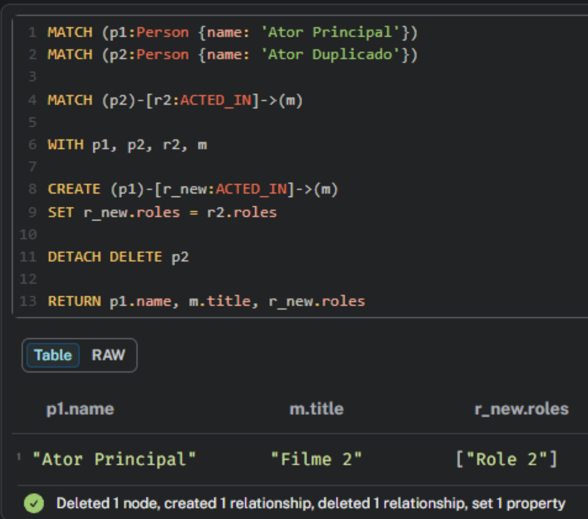

Na saída, vemos o filme e as roles atribuídas ao nosso nó principal. Após isso, excluímos o nó secundário juntamente com as suas dependências (relações) usando DETACH.

Agora, vemos o ator principal nos dois filmes fictícios que criamos:

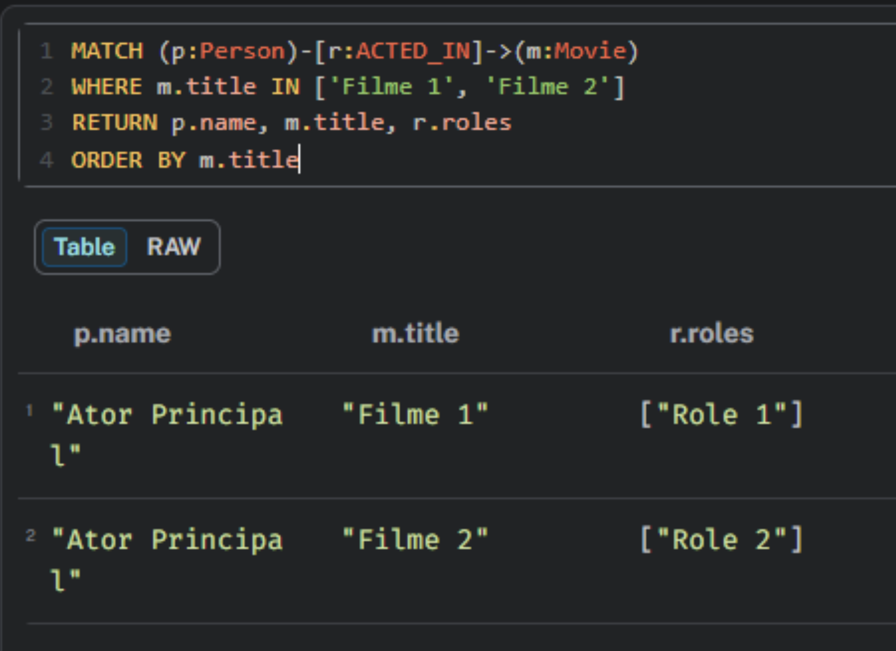


## Q3c. (1,0) Quais atores aparecem mais frequentemente em certos gêneros de filmes? Existe algum padrão que você percebe sobre a colaboração entre atores e gêneros? Atribua os gêneros (no mínimo 4) aos filmes a partir do seu título.

- Baseado no titulo atribuimos um gênero para cada filme:

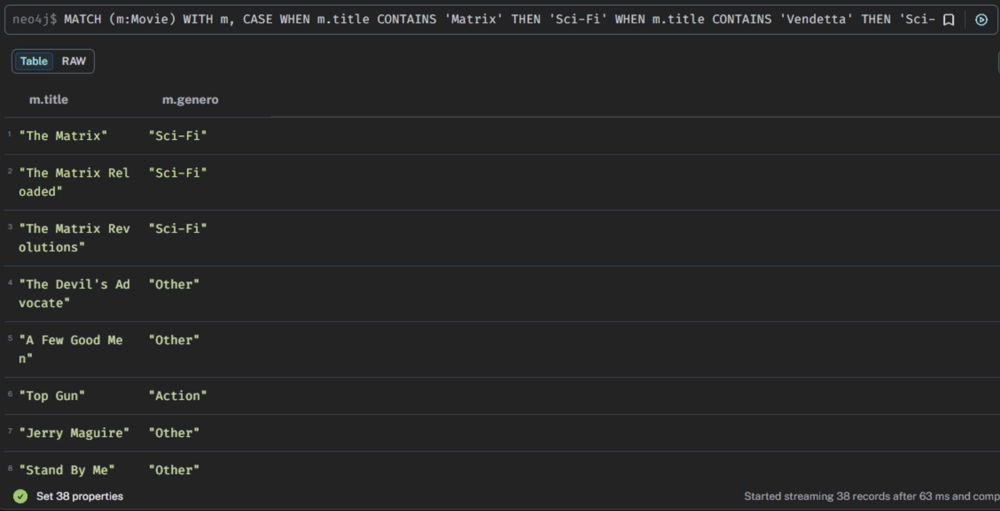

- Agora, para avaliar atores que apareceram mais frequentemente por gênero, fazemos o traversing em (Person)-[:ACTED_IN]->(Movie) e filtramos pelos filmes que classificamos. Depois, agrupamos por ator e gênero e contamos.

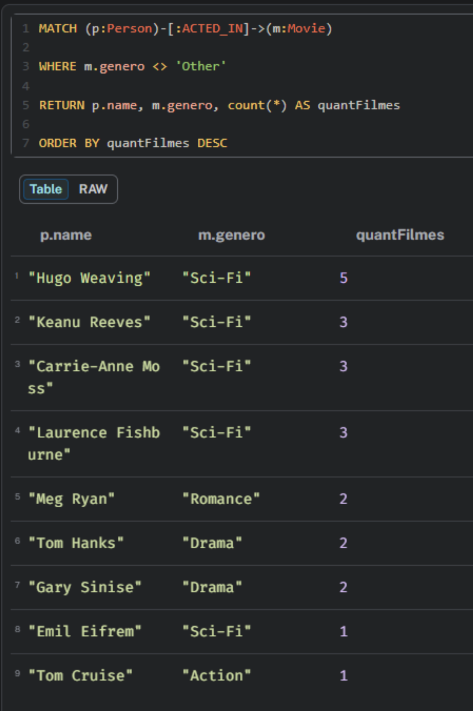

- Analisando a saída, nota-se que Hugo Weaving e Keanu Reeves são predominantes em filmes de ficção, enquanto Meg Ryan é predominante em Romance. Isso vale exclusivamente para nossa classificação.

querys utilizadas para questão 3:

```
MATCH (p:Person)
WHERE p.born IS NULL
RETURN p.name, p.born

CREATE (m1:Movie {title: 'Filme 1'})
CREATE (m2:Movie {title: 'Filme 2'})


CREATE (p1:Person {name: 'Ator Principal', born: 1980})
CREATE (p2:Person {name: 'Ator Duplicado'})


CREATE (p1)-[:ACTED_IN {roles:['Role 1']}]->(m1)
CREATE (p2)-[:ACTED_IN {roles:['Role 2']}]->(m2)

MATCH (p1:Person {name: 'Ator Principal'})
MATCH (p2:Person {name: 'Ator Duplicado'})


MATCH (p2)-[r2:ACTED_IN]->(m)


WITH p1, p2, r2, m


CREATE (p1)-[r_new:ACTED_IN]->(m)
SET r_new.roles = r2.roles


DETACH DELETE p2


RETURN p1.name, m.title, r_new.roles

MATCH (p:Person)-[r:ACTED_IN]->(m:Movie)
WHERE m.title IN ['Filme 1', 'Filme 2']
RETURN p.name, m.title, r.roles
ORDER BY m.title

MATCH (m:Movie)


WITH m,
CASE
WHEN m.title CONTAINS 'Matrix' THEN 'Sci-Fi'
WHEN m.title CONTAINS 'Vendetta' THEN 'Sci-Fi'
WHEN m.title CONTAINS 'Cloud Atlas' THEN 'Sci-Fi'
WHEN m.title CONTAINS 'Harry' THEN 'Romance'
WHEN m.title CONTAINS 'Mail' THEN 'Romance'
WHEN m.title CONTAINS 'Apollo 13' THEN 'Drama'
WHEN m.title CONTAINS 'Green Mile' THEN 'Drama'
WHEN m.title CONTAINS 'Top Gun' THEN 'Action'
ELSE 'Other'
END AS typeGenero


SET m.genero = typeGenero


RETURN m.title, m.genero

MATCH (p:Person)-[:ACTED_IN]->(m:Movie)


WHERE m.genero <> 'Other'


RETURN p.name, m.genero, count(*) AS quantFilmes


ORDER BY quantFilmes DESC
```
