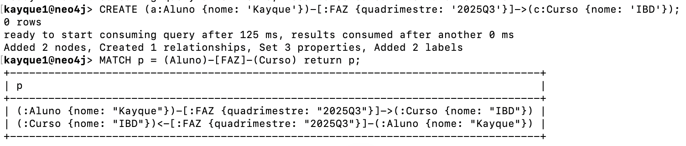
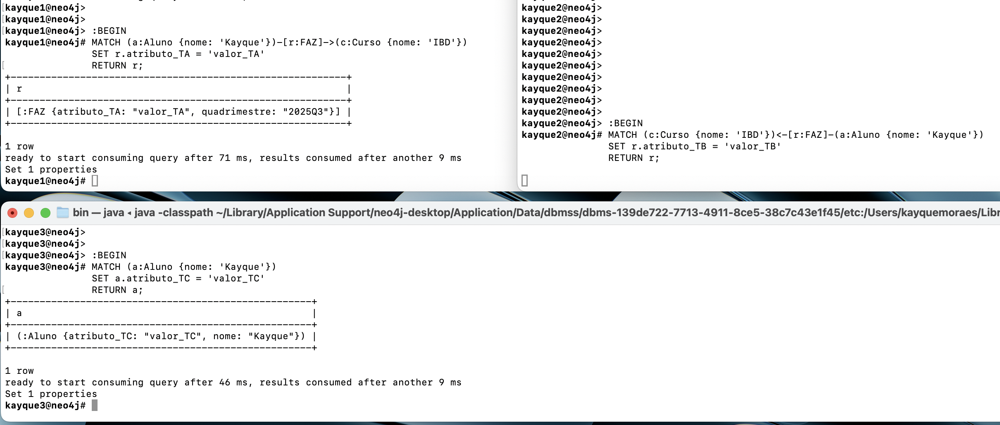
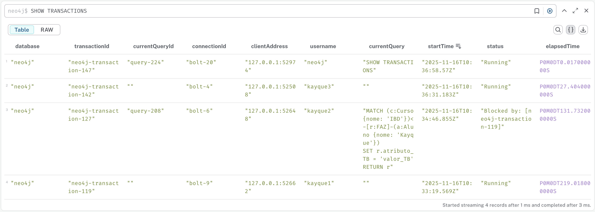
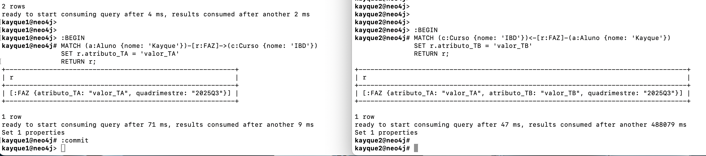
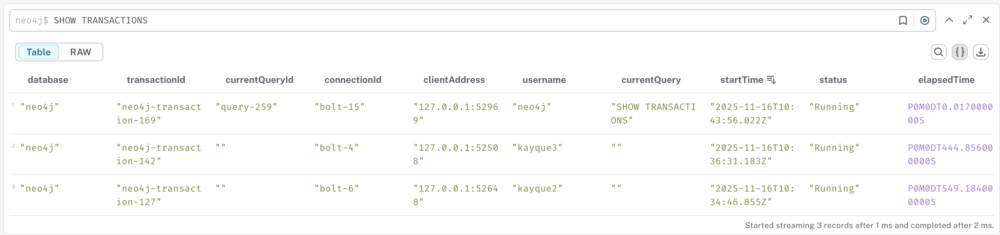
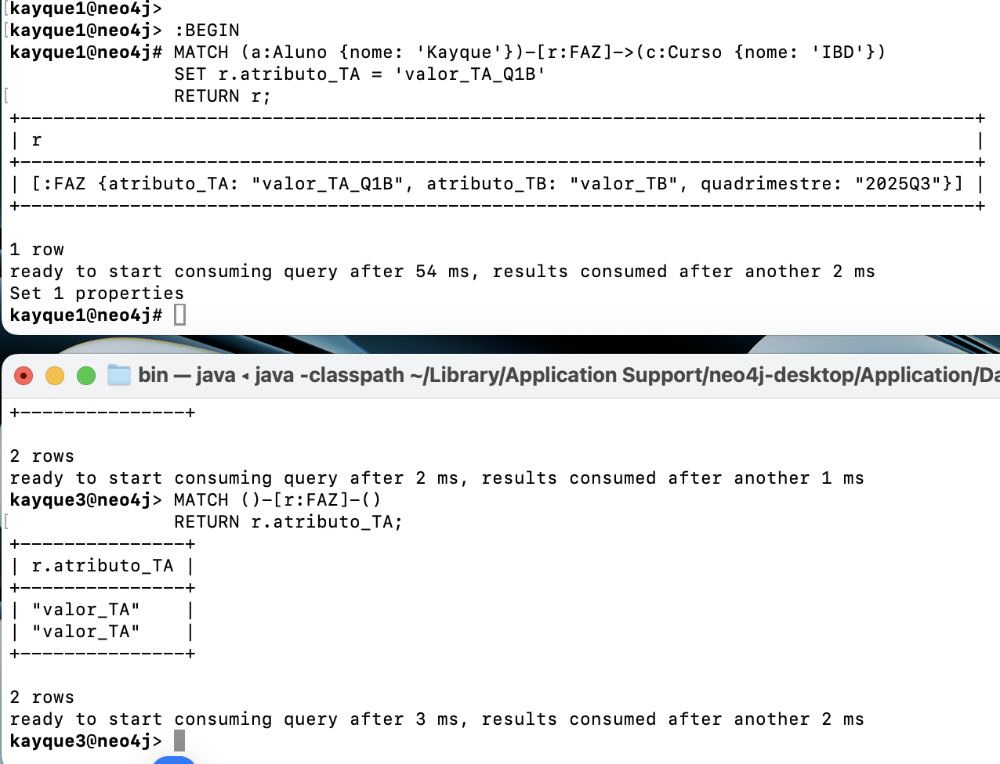
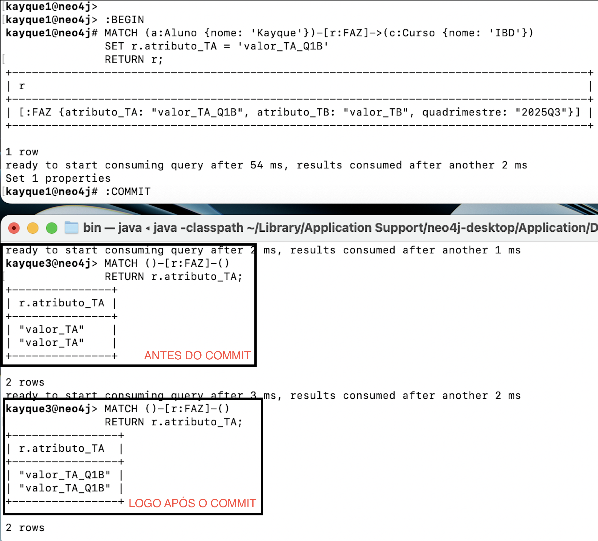
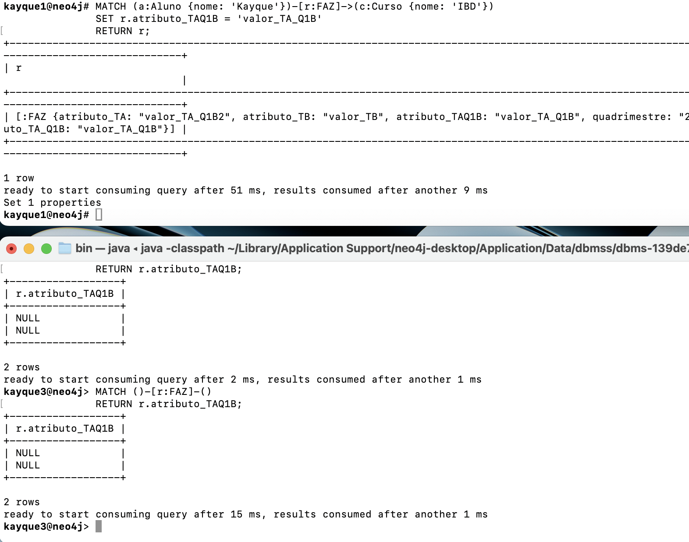
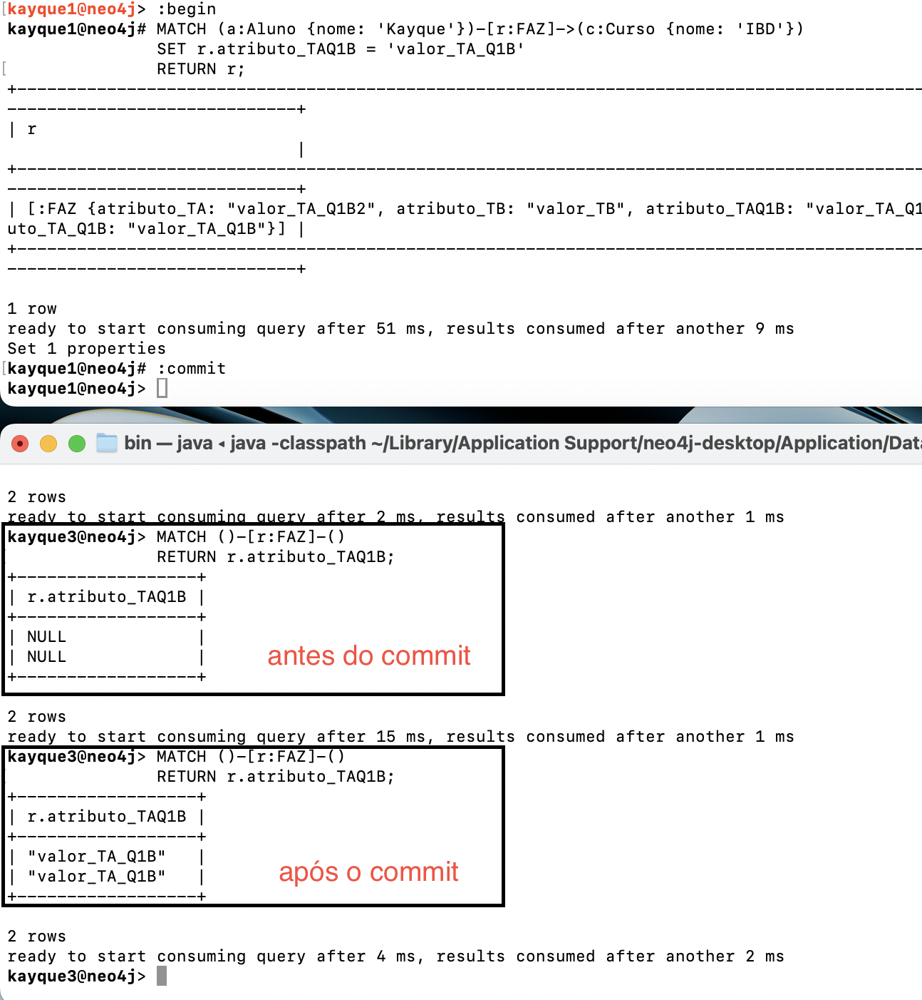

# Resolução - Atividade 04 - Manipulação e Transação em Grafos

## Conceitos/Definições:

WAL - Write-Ahead Log é uma técnica utilizada em sistemas de gerenciamento de banco de dados para garantir a durabilidade e a consistência das transações. O WAL registra todas as operações de modificação de dados antes que essas operações sejam aplicadas ao banco de dados. Isso permite que, em caso de falha do sistema, as transações possam ser recuperadas a partir do log, garantindo que nenhuma operação seja perdida.
Artigo interessante sobre WAL:
    - https://medium.com/@vinciabhinav7/write-ahead-logs-but-why-494c3efd722d
    
Neo4j tem suporte a transações ACID (Atomicidade, Consistência, Isolamento e Durabilidade). Isso significa que as operações realizadas dentro de uma transação são tratadas como uma única unidade de trabalho, garantindo que todas as operações sejam concluídas com sucesso ou nenhuma delas seja aplicada. O Neo4j utiliza o WAL para garantir a durabilidade das transações, registrando todas as alterações no log antes de aplicá-las ao banco de dados.
```WARNING: 
São Single Thread transactions, ou seja, cada transação é executada em uma única thread, o que simplifica o gerenciamento de concorrência e evita problemas relacionados a bloqueios e deadlocks. Isso significa que, quando uma transação está em andamento, outras transações devem aguardar sua conclusão antes de serem iniciadas.
```

Isolamento padrão é o nível de isolamento "Read Committed", que garante que uma transação só possa ler dados que foram confirmados por outras transações. Isso evita a leitura de dados não confirmados (dirty reads) e garante que as transações vejam um estado consistente do banco de dados.

Bolt é um protocolo de comunicação binário desenvolvido especificamente para o Neo4j. Ele é projetado para ser eficiente e rápido, permitindo que os clientes se conectem ao banco de dados Neo4j e executem consultas e operações de forma eficaz. O Bolt é otimizado para trabalhar com grafos, facilitando a transferência de dados entre o cliente e o servidor.

# Questão 1 (3.5):
Considere uma instância para o grafo `ALUNO` -[`FAZ`]→`CURSO`.

**TA:**
atualize (crie) um atributo qualquer na aresta `[FAZ]` partindo da seleção do aluno
não dê o commit

**TB:**
atualize (crie) outro atributo qualquer na aresta `[FAZ]` partindo da seleção do curso
não dê o commit

**TC:**
atualize (crie) um atributo qualquer no nó `ALUNO` partindo da seleção do mesmo.
não dê o commit

**TD:**
leia o atributo que você acrescentou na transação TA.

---

Com base nessas transações, responda as questões a seguir.

**Q1a. (1,75)** Crie três sessões simultâneas para executar as transações na seguinte ordem: TA→TB→TC. Quando você efetuar o *commit* dentro da transação TA, TC irá executar? Porque? Demonstre.

**Q1b. (1,75)** Crie três sessões simultâneas para executar as transações na seguinte ordem: TA→TD. A leitura do atributo foi possível ou não pela TD? Por que? Demonstre.

## Conexões:

Criei 3 usuários diferentes no Neo4j com as mesmas permissões apenas para facilitar a identificação das conexões:


neo4j command:
```
CREATE USER kayque1 SET PASSWORD 'xpto1234' CHANGE NOT REQUIRED;
GRANT ROLE admin TO kayque1;
```     

## Conectei os 3 usuários em 3 terminais diferentes e listei as conexões:
```
call dbms.listConnections();
```   


- 3 terminais conectados com 3 usuários diferentes


## Criando o grafo inicial:
```
CREATE (a:Aluno {nome: 'Kayque'})-[:FAZ {quadrimestre: '2025Q3'}]->(c:Curso {nome: 'IBD'});
```



## Montandos as transações:
### Transação TA:
```
:BEGIN

/* TA: Atualiza a ARESTA partindo do ALUNO */
MATCH (a:Aluno {nome: 'Kayque'})-[r:FAZ]->(c:Curso {nome: 'IBD'})
SET r.atributo_TA = 'valor_TA'
RETURN r;
```

### Transação TB:
```
:BEGIN

/* TB: Atualiza a ARESTA partindo do CURSO */
MATCH (c:Curso {nome: 'IBD'})<-[r:FAZ]-(a:Aluno {nome: 'Kayque'})
SET r.atributo_TB = 'valor_TB'
RETURN r;
```
### Transação TC:
```
:BEGIN

/* TC: Atualiza o NÓ ALUNO partindo do ALUNO */
MATCH (a:Aluno {nome: 'Kayque'})
SET a.atributo_TC = 'valor_TC'
RETURN a;
```

### Transação TD:
```
/* TD: Lê o atributo da Transação TA */
MATCH ()-[r:FAZ {semestre: 2025}]-()
RETURN r.atributo_TA;
```

### Prints das execuções:
- Status: Antes do COMMIT da TA
- o # no terminal indica que a transação está aberta (sem COMMIT ou ROLLBACK).



### Prints das transações TA, TB e TC com show transactions:
- A TB está travada (aguardando o COMMIT da TA)
- A TC executou normalmente (pois bloqueia o nó, não a aresta)



### Commit de TA:





- Após o COMMIT da TA, a TB executou normalmente (pois o lock foi liberado). 

## Explicação/Reposta Q1a:
 ```
 Quando TA inicia, ela adquire um bloqueio de escrita na aresta [FAZ]. Enquanto TA não for commitada, qualquer outra transação que tente modificar a mesma aresta, como TB, ficará bloqueada até que TA seja concluída - como visto na primeira imagem das transações. Isso garante a integridade dos dados e evita conflitos de escrita simultânea. Portanto, TB só pode prosseguir após o commit de TA, momento em que o bloqueio é liberado. O nível de lock é granular, o que isso quer dizer: que o bloqueio é aplicado apenas à aresta específica que está sendo modificada, permitindo que outras partes do grafo sejam acessadas ou modificadas por outras transações sem interferência, e mesmmo assim a TC conseguiu executar normalmente, pois bloqueia o nó, não a aresta.
 ```


## Explicação/Reposta Q1b:
## Testando com a alteração de um atributo já existente:
### Antes de executar o COMMIT da TA:



### Após executar o COMMIT da TA:


## Testando com a criação de um atributo novo:

### Antes do COMMIT da TA:



### Após o COMMIT da TA:



## Explicação/Reposta Q1b:
```
A transação TD não conseguiu ler o atributo criado por TA antes da execução do commit, e curiosamente não deu erro mesmo com o atributo sendo inexistente, algo que se espera por exemplo num banco de dados relacional... Enfim, a leitura só foi possível após o commit de TA, demonstrando o isolamento "Read Committed"
```