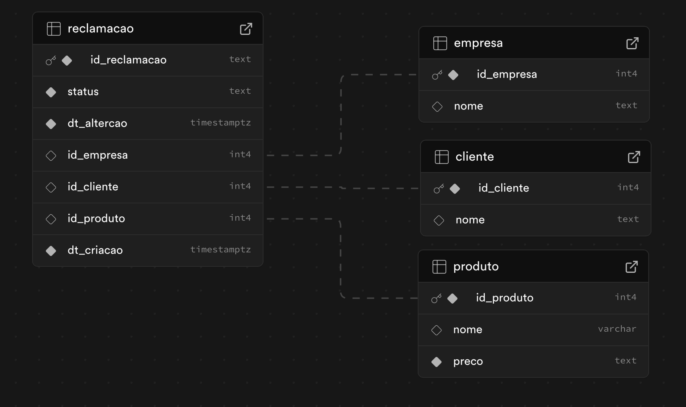
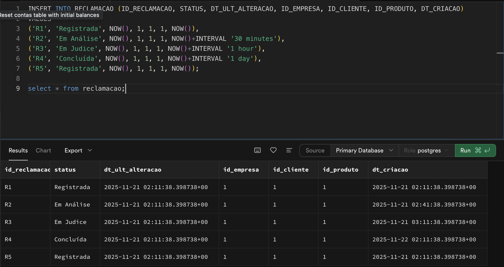

# Resolução - Atividade 05 - CRUD vs Evento

## Definições e Conceitos

Pré pesquisa sobre os conceitos de CRUD (Create, Read, Update, Delete) e Event Sourcing.

### CRUD
CRUD é um acrônimo que representa as quatro operações básicas de persistência de dados em sistemas de banco de dados. 
 - O que é persistência de dados? De forma grosseira é armazenar dados no banco. Mas não só isso, é ler, atualizar e excluir esses dados também, é essa interação precisa ser PERSISTENTE, ou seja, durar no tempo como após a reinicialização do sistema, por exemplo.

Essas operações são:
- **Create (Criar)**: Adicionar novos registros ao banco de dados.
- **Read (Ler)**: Recuperar dados existentes do banco de dados.
- **Update (Atualizar)**: Modificar dados existentes no banco de dados.
- **Delete (Excluir)**: Remover dados do banco de dados.

Basicamente o CRUD é desenvolvido para manipular diretamente o estado atual dos dados armazenados em um banco de dados relacional ou não relacional. O desenvolvedor back-end geralmente implementa essas operações que conectam a aplicação ao banco de dados - o famoso dev crudzeiro. 

### Event Sourcing - Ou traduzindo, Armazenamento por Eventos, Origem por Eventos, Fonte de Eventos... 

No CRUD a manipulação é direta no estado atual dos dados e o histórico das mudança não é armazenado - a menos que o desenvolvedor implemente isso manualmente - e apesar de alguns sistemas de banco de dados oferecem algo parecido com o histório de transações para replicação e rollback o intuito é do event sourcing é diferente, é para ter o histórico mesmo de todas as mudanças.

O Event source me lembra muito o modelo Fato x Dimensão que é muito usado em Data Warehouse e Data Lakes para análises de dados, onde o fato armazena os eventos de negócio (como vendas, transações) e as dimensões armazenam os atributos relacionados (como tempo, localização, produto). Então é uma tabela "de atributos" e uma tabela "de eventos" com as chaves relacionadas. Enfim... Acho que tem alguma relação conceitual. E também lembra o apache iceberg que armazena as mudanças de dados. Mas esses arquiteturas são mais focadas em análises de dados, enquanto o event sourcing é mais focado em sistemas transacionais... Voltando...


"Event-sourcing, centraliza a estrutura da aplicação em eventos, naturalmente facilitando a implementação do EDA (Event-driven Architecture)" - https://medium.com/@marcelomg21/event-sourcing-es-em-uma-arquitetura-de-microsserviços-852f6ce04595 - Marcelo M. Gonçalves 

Cada mudança de estado gera um evento que é armazenado de forma imutável. O estado atual do sistema pode ser reconstruído "reaplicando" esses eventos em ordem cronológica. Isso oferece várias vantagens, como auditabilidade completa, capacidade de reverter para estados anteriores e facilidade na implementação de funcionalidades como "time travel" (viagem no tempo) e "event replay" (reexecução de eventos) via checkpoints - realmente muito parecido com Apache Iceberg. 

Event-Store: Esse é o banco de dados para armazenar os eventos. O acesso a esses eventos é feito geralmente via APIs ou bibliotecas específicas que dão uma abstração para trabalhar com eventos. 

Quando um evento é persistido, um broadcast é feito para notificar outros componentes do sistema sobre essa mudança e os componentes "inscritos" podem reagir a esses eventos, atualizando seus próprios estados ou executando outras ações conforme necessário. 

Diretamente do artigo: 
```
Naturalmente, sempre que um evento é armazenado no event-store, automaticamente também é publicado em um canal de transmissão, sendo difundido e chegando aos componentes inscritos no evento, sendo então estimulados por ele (event-handlers).
O Event-store pode ser considerado o backbone (espinha dorsal) para aplicações baseadas em arquitetura de microsserviços utilizando EDA (Event-driven Architecture).
-  Marcelo M. Gonçalves

``` 

Segundo o Marcelo M. Gonçalves a vantagem do Event Sourcing em relação ao CRUD pode ser resumida em 3 pontos principais:
1. Auditabilidade completa: Cada mudança de estado é registrada como um evento imutável, permitindo rastrear todas as alterações feitas no sistema ao longo do tempo.
2. Reversibilidade: A capacidade de reverter para estados anteriores do sistema, facilitando a recuperação de dados e a correção de erros.
3. Facilidade na implementação de funcionalidades avançadas: Funcionalidades como "time travel" (viagem no tempo) e "event replay" (reexecução de eventos) podem ser implementadas de forma mais simples, permitindo análises históricas e testes de cenários.

`Os benefícios ao utilizar um estilo de persistência baseado em uma fonte de eventos incluem a possibilidade de logs de auditoria com maior precisão se comparado a modelos de persistência tradicionais, incluindo a facilidade na composição de queries temporais, por conta do histórico completo mantido.`

`Recomenda-se que o estado atual da aplicação seja mantido em um data-store separado, seja desnormalizado ou relacional, mantendo o event-store como base de auditoria para execução de processamentos especiais e isolados nos dados.`
- Mais uma vez uma similaridade com o modelo Fato x Dimensão, onde o fato armazena os eventos e a dimensão armazena o estado atual.

Os snapshots (checkpoints)... Por que existem?
 - Aqui entra uma estratégia bem interessante para otimizar a reconstrução do estado atual do sistema quando há muitos eventos.
    - Exemplo: Muitas alteações foram feitas num mesmo registros, então cada alteração gera um evento que será armazenado no meu event-store... E ai a coisa pode crescer demais. Então para otimizar uma foto é "tirada" do estado atual do sistema em um ponto específico no tempo e esse ponto seria um checkpoint. Assim, ao reconstruir o estado atual, o sistema pode começar a partir do checkpoint e aplicar apenas os eventos que ocorreram após esse ponto, reduzindo o número de eventos que precisam ser processados. É quase uma partição de dados a nível event-store.

```Warning
O event-store funciona com append-only, ou seja, os eventos são apenas adicionados e nunca modificados ou excluídos. Isso garante a integridade do histórico de eventos. Se algum evento precisar ser "removido" por questões legais ou de privacidade, uma abordagem comum é adicionar um novo evento que indica a remoção ou anonimização dos dados relacionados, em vez de excluir o evento original. - MAIS UMA SIMILARIDADE COM O APACHE ICEBERG, BIZARRO.
```
Enfim, lendo o artigo do Marcelo M. Gonçalves outras threads sao abertas como EDA e CQRS, mas isso foge do escopo dessa atividade...
### Resumo
Event Sourcing é um padrão arquitetural onde as mudanças de estado de um sistema são armazenadas como uma sequência de eventos imutáveis. Em vez de armazenar apenas o estado atual dos dados. Uma arquitetura parecida na camada analítica é a Fato x Dimensão que tem um conceito parecido. 


# ENUNCIADO DA ATIVIDADE

## Cenário
Você é arquiteto de dados responsável por escolher a forma de persistência em dois cenários distintos. Analise cada cenário e justifique se usaria CRUD ou Event Sourcing, destacando vantagens e limitações.

Sua organização é uma agência reguladora precisa armazenar informações sobre reclamações de consumidores contra outras empresas sobre algum produto. O ciclo de vida de uma reclamação é Registrada → Em Análise → Em Judice → Concluída.

## PARTE 1 - CRUD

>1. Modele a relação reclamação;

>2. Use operações INSERT, UPDATE e DELETE para gerenciar as reclamações com dados artificiais. Mantenha 5 reclamações (no mínimo) em diferentes momentos do ciclo de vida;

>3. Armazene apenas o estado atual de cada reclamação.

> - Perguntas orientadoras:


> Como ficaria a consulta para saber o status atual de uma reclamação?

> É possível responder "quanto tempo uma reclamação levou em cada etapa"?


### Resolução - Parte 1 - CRUD

#### 1. Modelo da relação reclamação:
Usei o Supabase para modelar a relação de reclamação com as tabelas relacionadas de cliente, empresa e produto. 
Ele gera o script SQL a partir do desenho.



```sql
-- WARNING: This schema is for context only and is not meant to be run.
-- Table order and constraints may not be valid for execution.

CREATE TABLE public.cliente (
  id_cliente integer NOT NULL,
  nome text,
  CONSTRAINT cliente_pkey PRIMARY KEY (id_cliente)
);
CREATE TABLE public.empresa (
  id_empresa integer NOT NULL,
  nome text,
  CONSTRAINT empresa_pkey PRIMARY KEY (id_empresa)
);
CREATE TABLE public.produto (
  id_produto integer NOT NULL,
  nome character varying,
  preco text NOT NULL DEFAULT '0'::text,
  CONSTRAINT produto_pkey PRIMARY KEY (id_produto)
);
CREATE TABLE public.reclamacao (
  id_reclamacao text NOT NULL,
  status text NOT NULL,
  dt_ult_alteracao timestamp with time zone NOT NULL,
  id_empresa integer,
  id_cliente integer,
  id_produto integer,
  dt_criacao timestamp with time zone NOT NULL,
  CONSTRAINT reclamacao_pkey PRIMARY KEY (id_reclamacao),
  CONSTRAINT reclamacao_id_empresa_fkey FOREIGN KEY (id_empresa) REFERENCES public.empresa(id_empresa),
  CONSTRAINT reclamacao_id_cliente_fkey FOREIGN KEY (id_cliente) REFERENCES public.cliente(id_cliente),
  CONSTRAINT reclamacao_id_produto_fkey FOREIGN KEY (id_produto) REFERENCES public.produto(id_produto)
);

```

#### 2. Operações INSERT, UPDATE e DELETE para gerenciar as reclamações:

```sql
-- Inserindo dados artificiais nas tabelas relacionadas

INSERT INTO EMPRESA (ID_EMPRESA, NOME) VALUES (1, 'Empresa A');
INSERT INTO CLIENTE (ID_CLIENTE, NOME) VALUES (1, 'Cliente A');
INSERT INTO PRODUTO (ID_PRODUTO, NOME, PREÇO) VALUES (1, 'Produto A', '100');
-- Inserindo reclamações
INSERT INTO RECLAMACAO (ID_RECLAMACAO, STATUS, DT_ULT_ALTERACAO, ID_EMPRESA, ID_CLIENTE, ID_PRODUTO, DT_CRIACAO) 
VALUES 
('R1', 'Registrada', NOW(), 1, 1, 1, NOW()),
('R2', 'Em Análise', NOW(), 1, 1, 1, NOW()+INTERVAL '30 minutes'),
('R3', 'Em Judice', NOW(), 1, 1, 1, NOW()+INTERVAL '1 hour'),
('R4', 'Concluída', NOW(), 1, 1, 1, NOW()+INTERVAL '1 day'),
('R5', 'Registrada', NOW(), 1, 1, 1, NOW());

```
#### 3. Armazenar apenas o estado atual de cada reclamação.
Já está feito no passo anterior, onde cada reclamação tem apenas o estado atual armazenado na tabela RECLAMACAO.



Respondendo as perguntas orientadoras:
- Consulta para saber o status atual de uma reclamação:
Basta fazer a consulta simples buscando o ID da reclamação desejada.

```sql
SELECT STATUS 
FROM RECLAMACAO 
WHERE ID_RECLAMACAO = 'R1';
```
- É possível responder "quanto tempo uma reclamação levou em cada etapa"?
Não, com o modelo CRUD tradicional, não é possível rastrear o tempo que uma reclamação levou em cada etapa, pois apenas o estado atual é armazenado. 

Eu poderia ter modelado pensando em uma coluna para cada etapa com timestamps.

